# Pattern-Vault

Welcome to **PatternVault**, a curated collection of pattern-based coding problems designed to sharpen your problem-solving skills. This repository is perfect for programmers, students, and coding enthusiasts looking to practice, explore, and master patterns in programming.  

## 🌟 Features  
- A wide range of pattern problems from beginner to advanced levels.  
- Solutions written in multiple programming languages (add specific ones if applicable).  
- Clear and concise explanations for each pattern.  
- Perfect for coding interviews, competitions, and self-practice.   
1. Right-Angled Triangle 
   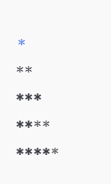  
2. Pyramid Star 
   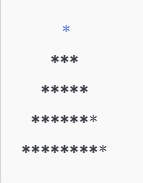  
3. Increasing Numbers  
   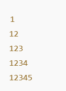  
4. Diamond Pattern  
   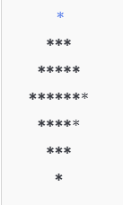  
5. Inverted Right Angled Triangle  
   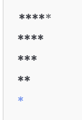  
6. Alphabet Triangle  
   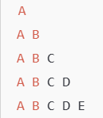  
7. Number Pyramid  
   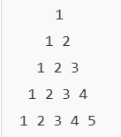  
8. Inverted Pyramid  
   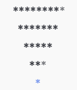
9. Alphabet Pyramid  
   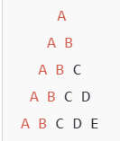
10. Hollow Square  
   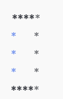
11. Checkboard Pattern  
   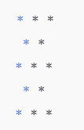
11. Reverse Number Pyramid  
    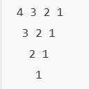
12. Floyd’s Triangle  
    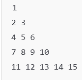
13. Pascal’s Triangle  
   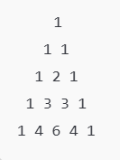
   

   
